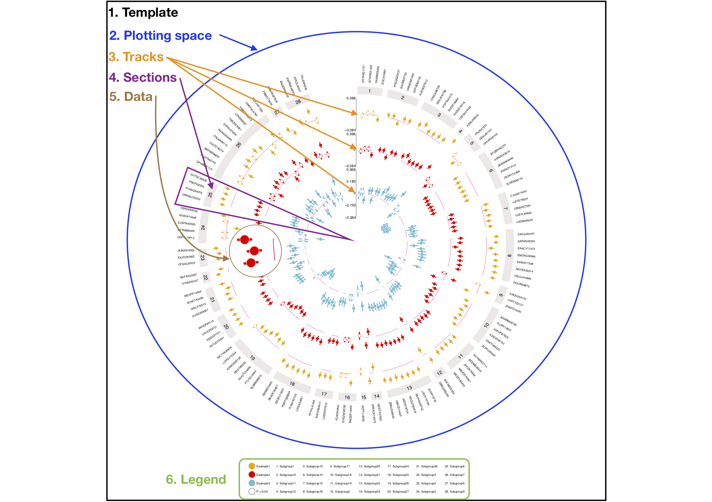

# `EpiViz`: an implementation of Circos plots for epidemiologists

Circos plots enable visualisation of large amounts of data but can be cumbersome to produce. `EpiViz` is intended to streamline and enable the efficient creation of Circos plots for a range of data typicaly used by epidemiologists.

`EpiViz` was designed with metabolite association analyses in mind. These analyses involve hundreds of metabolites which can be grouped together in different combinations. Of particular interest in these studies is how groups of metabolites behave rather than individual metabolites. In this instance we use the sections of the Circos plot to plot individual groups of metabolites and look at the overall picture for that group of metabolites.

The `R` package builds on the [`Circlize`](https://github.com/jokergoo/circlize) and [`ComplexHeatmap`](https://github.com/jokergoo/ComplexHeatmap) `R` packages to make prodcuing Circos plots quicker and easier for reserachers.

Circular layouts provide a unique way to visualise large amounts of information. An alternative approach is the [`rainplot`](https://github.com/rainplots/rainplots). However, if you have less than 50 data points (i.e. less than 50 rows in a data frame) you should try visualising your data using forest plots - [`ggforestplot`](https://nightingalehealth.github.io/ggforestplot/index.html) and `forest_plot_1_to_many()` from [`TwoSampleMR`](https://mrcieu.github.io/TwoSampleMR/articles/perform_mr.html#to-many-forest-plot).

## Citation

**Please cite the `R` package as follows:**

Lee M. A, Mahmoud O, Hughes D, Wade K. H, Corbin L. J, McGuinness L. J, Timpson N. J. Epiviz: an implementation of Circos plots for epidemiologists. 2020. <https://github.com/mattlee821/EpiViz>

Gu Z, Gu L, Eils R, Schlesner M, Brors B. circlize Implements and enhances circular visualization in R. Bioinformatics. 2014;30(19):2811–2812. <doi:10.1093/bioinformatics/btu393>

Gu Z, Eils R, Schlesner M. Complex heatmaps reveal patterns and correlations in multidimensional genomic data. Bioinformatics. 2016;32(18):2847–2849. <doi:10.1093/bioinformatics/btw313>

## How it works

Circos plots are composed of six elements: template, plotting space, tracks, sections, data, legend. The template element is a square of defined proportions within which information is plotted. Each additional element is layered onto the template one after the other. The plotting space element is an empty circle which is layered and centered on top of the template. Data is plotted on to the plotting space. An optional extra of the Circos plot, the legend element takes the dimensions of the template and creates a seperate plotting space that can be layered on to the bottom of the template element.  

The plotting space is seperated into tracks and sections. Tracks are laid down as rings within the plotting space. Each track represents a single element of information such as an exposure. Tracks are numbered from the outside to the centre of the circle and coloured seperately. Sections divide the plotting space into distinct groups, much like a pie chart. Sections are defined by the data and usually represent groups of outcomes such as metabolite classes. A section track is laid at the outside of the tracks to give a header element for each section. The section header is referenced in the legend element.  

Once the template, plotting space, tracks and sections are laid down, coordinates for each section and track location can be called to plot the data element. Each track and section coordinate, e.g. track 2 section 3, is treated as an individual plotting space. As such, data can be plotted based on the following coordinates: track, section, *X*, *Y*. The *X* axis of each track is defined by the number of rows in the data frame, i.e a data frame with 100 rows will have an *X* axis of length 100 with each row given an *X* axis coordinate from 1:100. The *Y* axis is defined by the minimum and maximum of the data for that track. As such, each track and section coordinate, e.g. track 2 section 3, can be considered an individual plot with a *Y* axis that is shared by all of the sections in that track. For each position on the *X* axis the label element of each row is plotted outside of the section header.  

