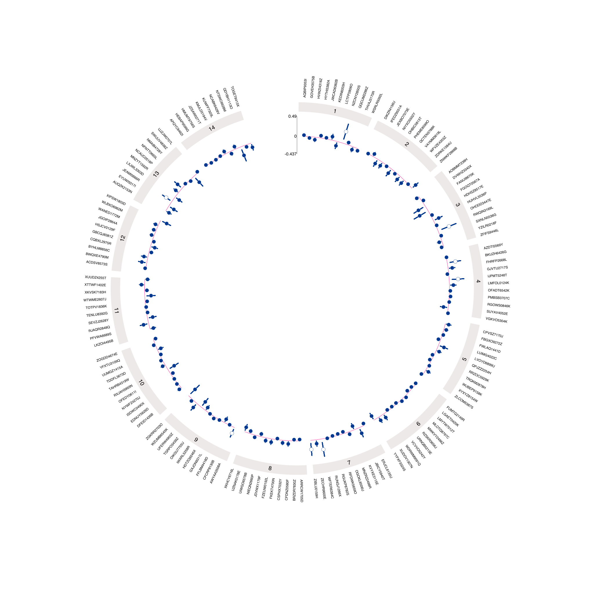

# `EpiViz`: `R` package

The R package is designed to make creating Circos plots quick and easy.
It is intended for people with some familiarity with `R`. <br>

## Install

Install directly from GitHub using the following code:

``` r
# Install devtools
install.packages("devtools")
library(devtools)

# Install EpiViz directly from GitHub
devtools::install_github("mattlee821/EpiViz/R_package")
library(EpiViz)
```

 

You may be unable to install the pakcage because of an issue installing
`ComplexHeatmap`. An example error:

``` r
Skipping 1 packages not available: ComplexHeatmap
Installing 12 packages: circlize, ComplexHeatmap, digest, dplyr, ellipsis, GlobalOptions, pillar, Rcpp, rlang, shape, tibble, vctrs
Error: (converted from warning) package ‘ComplexHeatmap’ is not available (for R version 3.5.3)
```

 

To fix this you should install
[`ComplexHeatmap`](https://jokergoo.github.io/ComplexHeatmap-reference/book/)
first and then `EpiViz`:

``` r
# Install devtools
install.packages("devtools")
library(devtools)

# Install ComplexHeatmap directly from Bioconductor
if (!requireNamespace("BiocManager", quietly=TRUE))
    install.packages("BiocManager")
BiocManager::install("ComplexHeatmap")

# Install EpiViz directly from GitHub
devtools::install_github("mattlee821/EpiViz/R_package")
library(EpiViz)
```

## How to

### Step 1: data preperation

Example data is provided with the package and can be assigned
with`data <- EpiViz::EpiViz_data*` – where `*` is 1-3. The data can be
used directly in the `circos_plot()` function by assigning it to
`track1_data = EpiViz::EpiViz_data*`. For more info
`?EpiViz::EpiViz_data*`. When using your own data, your data frame needs
to include:

-   label column
-   effect estimate column
-   p-value column
-   lower confidence interval column
-   upper confidence interval column
-   section column

<table>
<thead>
<tr>
<th style="text-align:left;">
label
</th>
<th style="text-align:right;">
effect\_extimate
</th>
<th style="text-align:right;">
p\_value
</th>
<th style="text-align:right;">
lower\_confidence\_interval
</th>
<th style="text-align:right;">
upper\_confidence\_interval
</th>
<th style="text-align:left;">
group
</th>
</tr>
</thead>
<tbody>
<tr>
<td style="text-align:left;">
label1
</td>
<td style="text-align:right;">
0.11
</td>
<td style="text-align:right;">
0.01
</td>
<td style="text-align:right;">
0.10
</td>
<td style="text-align:right;">
0.12
</td>
<td style="text-align:left;">
Group1
</td>
</tr>
<tr>
<td style="text-align:left;">
label2
</td>
<td style="text-align:right;">
0.12
</td>
<td style="text-align:right;">
0.02
</td>
<td style="text-align:right;">
0.11
</td>
<td style="text-align:right;">
0.13
</td>
<td style="text-align:left;">
Group1
</td>
</tr>
<tr>
<td style="text-align:left;">
label3
</td>
<td style="text-align:right;">
0.13
</td>
<td style="text-align:right;">
0.03
</td>
<td style="text-align:right;">
0.12
</td>
<td style="text-align:right;">
0.14
</td>
<td style="text-align:left;">
Group2
</td>
</tr>
<tr>
<td style="text-align:left;">
label4
</td>
<td style="text-align:right;">
0.14
</td>
<td style="text-align:right;">
0.04
</td>
<td style="text-align:right;">
0.13
</td>
<td style="text-align:right;">
0.15
</td>
<td style="text-align:left;">
Group3
</td>
</tr>
<tr>
<td style="text-align:left;">
label5
</td>
<td style="text-align:right;">
0.15
</td>
<td style="text-align:right;">
0.05
</td>
<td style="text-align:right;">
0.14
</td>
<td style="text-align:right;">
0.16
</td>
<td style="text-align:left;">
Group3
</td>
</tr>
</tbody>
</table>

#### Section column

Circos plots are broken up into sections. The number of sections, and
what data is included in them, is defined by the section column of the
data frame. The sections are determined by the number of factor levels
within the section column. You can have as many sections as desired.

If your data does not have groups you still need to include a section
column. Instead of having multiple levels in the column you can have a
single level. A single section will be plotted around the entirety of
the Circos plot as a result.

### Step 2: making the plot

Circos plots can be created by calling `circos_plot()`. You can plot up
to three tracks using `track_number =`. The plot is limited to three
tracks for readability. The simplest Circos plot to make is with 1
track.

``` r
circos_plot(track_number = 1, # how many tracks do you want to plot
            track1_data = EpiViz::EpiViz_data1, # what is the dataframe for your first track
            track1_type = "points", # how do you want to plot your first track
            label_column = 1, # whats is the column of your labels
            section_column = 2, # what is the column of your sections
            estimate_column = 4, # what is the column of your estimate (beta, OR etc.)
            pvalue_column = 5, # what is the column of your p-value
            pvalue_adjustment = 1, # what do you want your p-value adjustment to be = 0.05/X
            lower_ci = 7, # what is the column of your lower confidence interval
            upper_ci = 8) # what is the column of your upper confidence interval
```



#### Multiple tracks

You can have multiple tracks each with differnt styles. Track styles can
be: `"points"`, `"lines"`, `"bar"`, `"histogram"`. For each track a
seperate data frame must be provided. The data frames must:

-   have the same columns - names and order
-   have the same number of rows

``` r
circos_plot(track_number = 3,
            track1_data = EpiViz::EpiViz_data1,
            track2_data = EpiViz::EpiViz_data2,
            track3_data = EpiViz::EpiViz_data3,
            track1_type = "points",
            track2_type = "lines",
            track3_type = "bar",
            label_column = 1,
            section_column = 9,
            estimate_column = 2,
            pvalue_column = 3,
            pvalue_adjustment = 1,
            lower_ci = 4,
            upper_ci = 5,
            lines_column = 2,
            lines_type = "o",
            bar_column = 2)
```


 

## Legend

The legend function is taken from
[`ComplexHeatmap`](https://github.com/jokergoo/ComplexHeatmap). It will
place a legend at the bottom of the plot. The legend will be populated
with: points coloured for each track and a label for each track, a point
for p-value label, and section headers.

``` r
circos_plot(track_number = 3,
            track1_data = EpiViz::EpiViz_data1,
            track2_data = EpiViz::EpiViz_data2,
            track3_data = EpiViz::EpiViz_data3,
            track1_type = "points",
            track2_type = "lines",
            track3_type = "bar",
            label_column = 1,
            section_column = 9,
            estimate_column = 2,
            pvalue_column = 3,
            pvalue_adjustment = 1,
            lower_ci = 4,
            upper_ci = 5,
            lines_column = 2,
            lines_type = "o",
            bar_column = 2,
            legend = TRUE,
            track1_label = "Track 1",
            track2_label = "Track 2",
            track3_label = "Track 3",
            pvalue_label = "<= 0.05",
            circle_size = 25)
```


 

## Saving plots

For best results save your plot as `PDF` or `SVG`. Both can be converted
to other image formats. The following code can be used to save as either
`PDF` or `SVG`. Adjust the `width` and `height` functions to get the
correct sizing for your plot and then adjust the `pointsize` function.
The following values for each work for most plots:

``` r
pdf("my_plot.pdf",
    width = 30, height = 30, pointsize = 35)
circos_plot(...)
dev.off()
```

If just using the `RStudio` plots panel you will not be able to see the
finished plot as it will appear. Similarly, saving as anything other
than `PDF` will not give a good visualisation.

## Other stuff

### Colours

The colours are from [i want hue](https://medialab.github.io/iwanthue/)
and are colourblind friendly. To change colours use the `colours`
argument, where the first colour is for the first track, the second
colour for the second track, and the third colour for the third track.

``` r
colours = c("#00378f", # track 1 colour
            "#ffc067", # track 2 colour
            "#894300") # track 3 colour
```

### Ordering sections

By default sections are ordered alphabetically. To change this, set
`order = FALSE` and provide a column to order your sections on using
`order_column =` (see code below). This will reorder the factors in your
section column and plot them in the ascending order of the
`order_column`. Your order column should be `1:n`, where n is the number
of sections and each variable within the section has the same value. If
we ordered the below table by the default setting the sections would be
plotted in order of Group1 - Group3. If we plotted based on the order
column the sections would be plotted Group3 - Group1.

<table>
<thead>
<tr>
<th style="text-align:left;">
label
</th>
<th style="text-align:left;">
group
</th>
<th style="text-align:left;">
order
</th>
</tr>
</thead>
<tbody>
<tr>
<td style="text-align:left;">
label1
</td>
<td style="text-align:left;">
Group1
</td>
<td style="text-align:left;">
3
</td>
</tr>
<tr>
<td style="text-align:left;">
label2
</td>
<td style="text-align:left;">
Group1
</td>
<td style="text-align:left;">
3
</td>
</tr>
<tr>
<td style="text-align:left;">
label3
</td>
<td style="text-align:left;">
Group2
</td>
<td style="text-align:left;">
2
</td>
</tr>
<tr>
<td style="text-align:left;">
label4
</td>
<td style="text-align:left;">
Group3
</td>
<td style="text-align:left;">
1
</td>
</tr>
<tr>
<td style="text-align:left;">
label5
</td>
<td style="text-align:left;">
Group3
</td>
<td style="text-align:left;">
1
</td>
</tr>
</tbody>
</table>

``` r
circos_plot(...
            order = FALSE,
            order_column = 11,
            ...)
```

## Session info

    ## R version 4.0.5 (2021-03-31)
    ## Platform: x86_64-apple-darwin17.0 (64-bit)
    ## Running under: macOS Big Sur 10.16
    ## 
    ## Matrix products: default
    ## BLAS:   /Library/Frameworks/R.framework/Versions/4.0/Resources/lib/libRblas.dylib
    ## LAPACK: /Library/Frameworks/R.framework/Versions/4.0/Resources/lib/libRlapack.dylib
    ## 
    ## locale:
    ## [1] en_GB.UTF-8/en_GB.UTF-8/en_GB.UTF-8/C/en_GB.UTF-8/en_GB.UTF-8
    ## 
    ## attached base packages:
    ## [1] stats     graphics  grDevices utils     datasets  methods   base     
    ## 
    ## loaded via a namespace (and not attached):
    ##  [1] rstudioapi_0.13   knitr_1.36        xml2_1.3.2        magrittr_2.0.1   
    ##  [5] rvest_1.0.0       munsell_0.5.0     colorspace_2.0-2  viridisLite_0.4.0
    ##  [9] R6_2.5.1          rlang_0.4.11      fastmap_1.1.0     highr_0.9        
    ## [13] stringr_1.4.0     httr_1.4.2        tools_4.0.5       webshot_0.5.2    
    ## [17] xfun_0.26         htmltools_0.5.2   systemfonts_1.0.2 yaml_2.2.1       
    ## [21] digest_0.6.28     lifecycle_1.0.1   kableExtra_1.3.4  glue_1.4.2       
    ## [25] evaluate_0.14     rmarkdown_2.11    stringi_1.7.5     compiler_4.0.5   
    ## [29] scales_1.1.1      svglite_2.0.0
