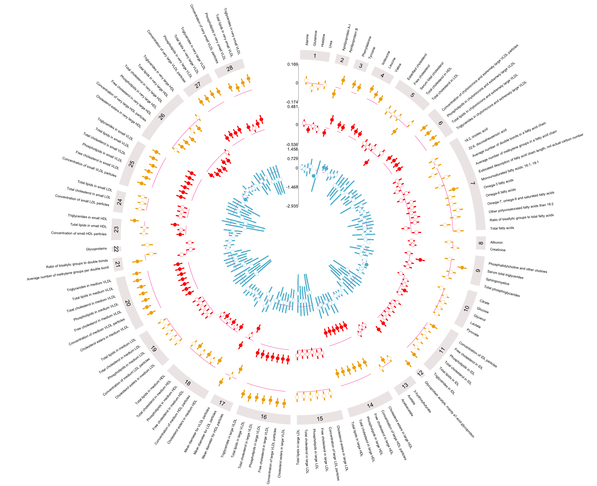
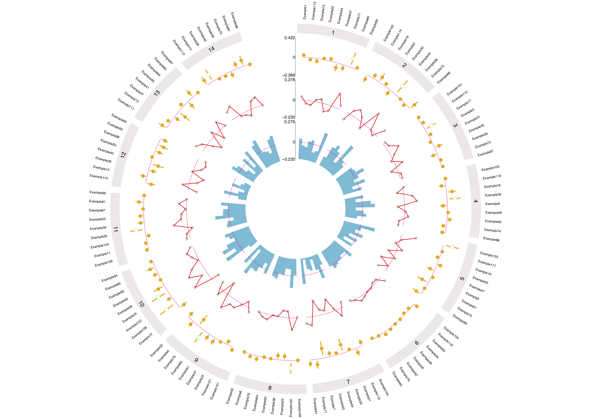

<html>

<body>

<!-- Header -->

<!-- Photo Grid -->

 

  <!-- Column 1 -->
  

  
  
  
  

  
  <!-- Column 2 -->
  

  
  
 
  
  <!-- Column 3 -->
  

  
  
 
  
  <!-- Column 4 -->
  

  
  
 

</body>
</html>
