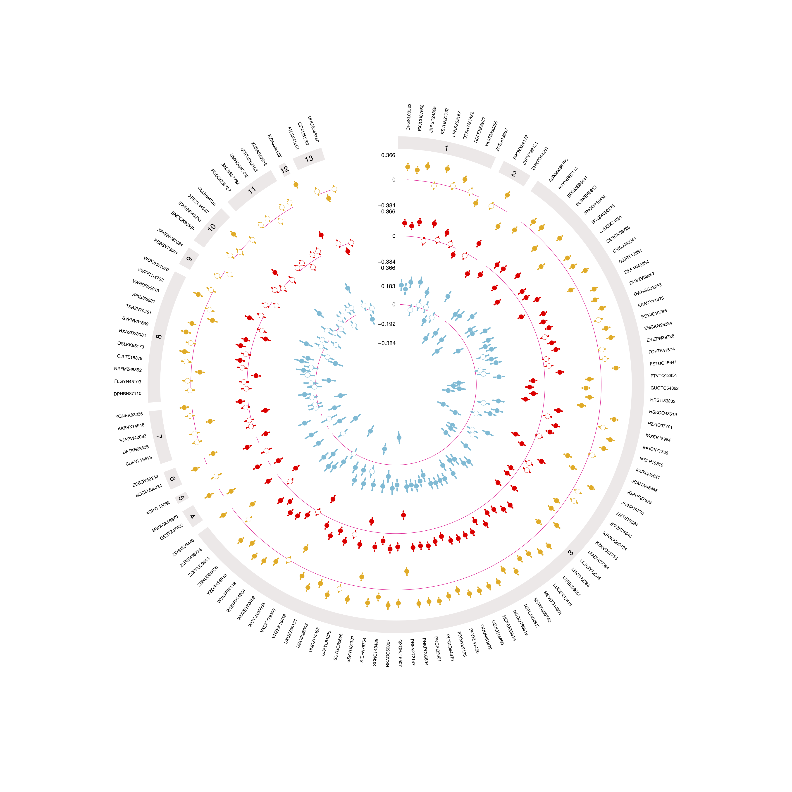
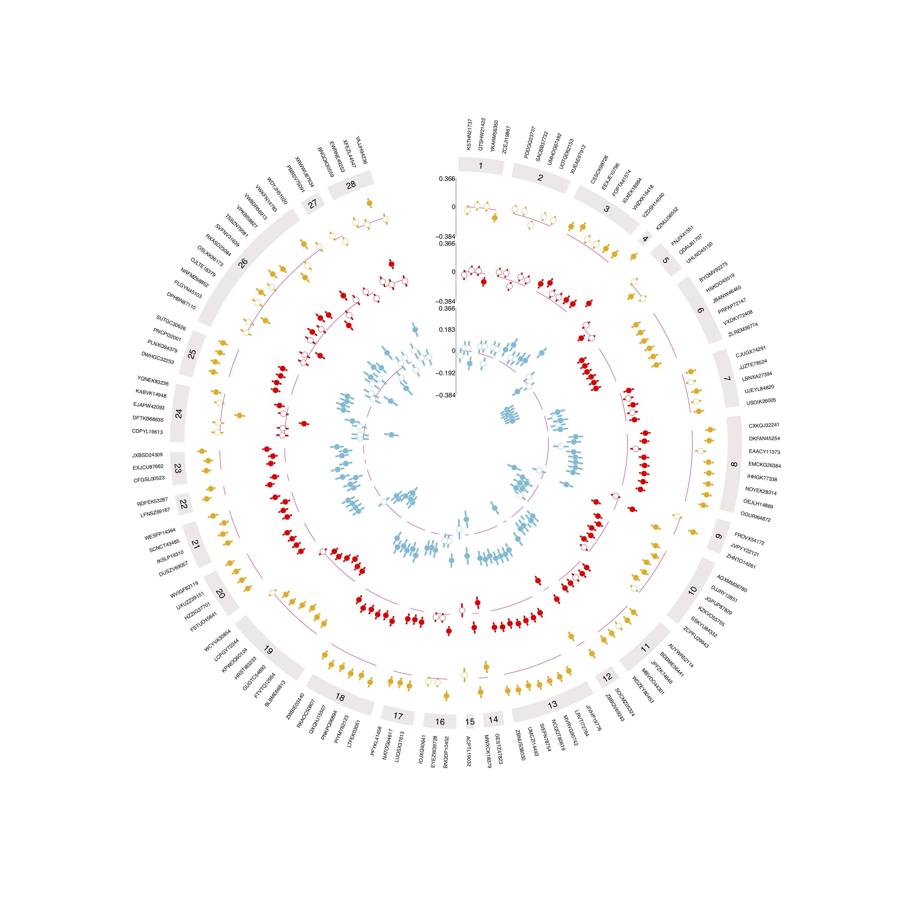

You can download <strong>example data</strong> and use this to guide you through using the app. Each of the three example data sets are identical and set-up with two grouping columns that will produce the following two plots:

