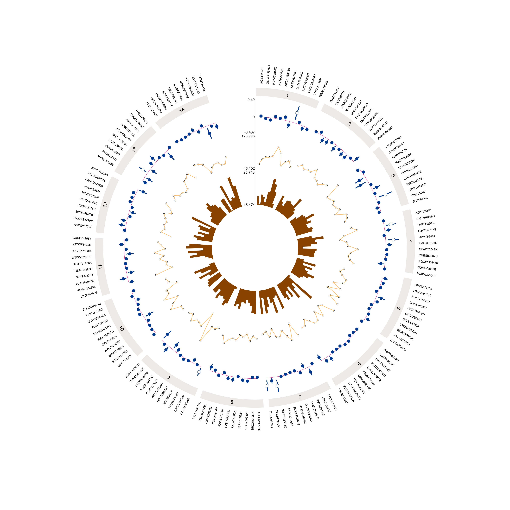

<h3>Step 3: next steps...</h3>

You've made a plot but what next?

<h4>Is this the right plot?</h4>
Is a Circos plot the most appropriate type of plot for your data? You should consider whether your data would be better visualised by other method. In particular, if you have fewer than 50 variables <a href="https://nightingalehealth.github.io/ggforestplot/index.html">forest plots</a> are a good option. An alternative to Circos plots if you have lots of data are <a href="https://github.com/rainplots/rainplots">rainplots</a>.

<h4>Groups</h4>

Using groups can help to identify patterns in your data. The way groups are created can be informative when examining the global patterns of association. You can try grouping your data in different ways; examples of clustering approaches include: 

<ul>
  <li><a href="">Biological pathway</a></li>
  <li><a href="https://www.annualreviews.org/doi/10.1146/annurev.genet.35.102401.090633">Genetic architecture</a></li>
  <li><a href="http://www.scielo.br/scielo.php?script=sci_arttext&pid=S1415-790X2019000100439&tlng=en">Principal component analysis</a></li>
  <li><a href="http://www.scielo.br/scielo.php?script=sci_arttext&pid=S1415-790X2019000100439&tlng=en">Factor analysis</a></li>
  <li><a href="https://www.ncbi.nlm.nih.gov/pmc/articles/PMC3022837/">Hierarchical clustering</a></li>
  <li><a href="https://almob.biomedcentral.com/articles/10.1186/1748-7188-3-9">Self organising maps</a></li>
  <li><a href="https://www.nature.com/articles/ng.3211">Linkage disequilibrium score regression</a></li>
  <li><a href="https://archive.siam.org/meetings/sdm06/workproceed/Text%20Mining/jing1.pdf">Ontology</a></li>
</ul>

<h4>Advanced plots</h4>

The <a href="https://github.com/mattlee821/EpiViz/tree/master/R_package"<code>R</code> package</a> offers more functionality, including line and box plots. The <code>R</code> code can be adapted and guidance is provided to enable this. The web application will be maintained but future enhancements will be made to the <code>R</code> package.

