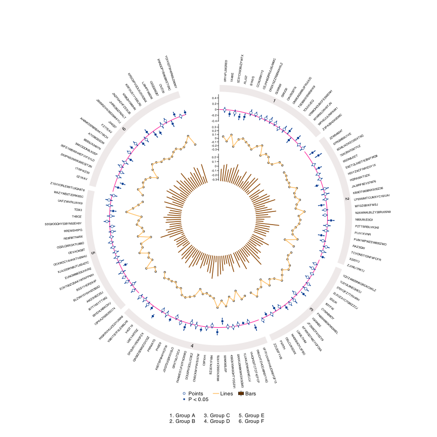

# 3. Extras

## Lines and Bars

`EpiViz` allows you to visualize data using different plot types across
tracks. This is particularly powerful when you want to show different
aspects of your data simultaneously.

You can combine points, lines, and bars in a single plot.

``` r
circos_plot(
  track_number = 3,
  track1_data = EpiViz_data1,
  track2_data = EpiViz_data2,
  track3_data = EpiViz_data3,
  track1_type = "points",
  track2_type = "lines",
  track3_type = "bar",
  label_column = "label",
  section_column = "class",
  estimate_column = "beta",
  pvalue_column = "pvalue",
  lower_ci = "lower_confidence_interval",
  upper_ci = "upper_confidence_interval",
  lines_column = "beta",
  bar_column = "beta",
  circle_size = 25
)
```


## Legends

A key feature of `EpiViz` is its ability to automatically generate
comprehensive legends using `ComplexHeatmap`. There are two types of
legends:

#### 1. Track Legend (`legend_track`)

This legend summarizes the tracks and significance indicators
(significant vs. non-significant points). It is positioned at the bottom
of the plot.

The `legend_track` parameter accepts: - `FALSE` - No legend (default) -
`TRUE` - Horizontal legend at the default distance (`0.05`) from the
bottom. - A numeric value (e.g., `0.1`) - Distance from the bottom of
the plot in NPC units (0-1).

#### 2. Section Legend (`legend_section`)

This legend provides a numbered key for the categories defined in
`section_column`. This is particularly useful if your category names are
long or if you have many sectors.

The `legend_section` parameter accepts: - `FALSE` - No legend
(default) - `TRUE` - Horizontal legend at the default distance (`0.05`)
from the bottom. - A numeric value (e.g., `0.03`) - Distance from the
bottom of the plot in NPC units.

``` r
circos_plot(
  track_number = 3,
  track1_data = EpiViz_data1,
  track2_data = EpiViz_data2,
  track3_data = EpiViz_data3,
  track1_type = "points",
  track2_type = "lines",
  track3_type = "bar",
  label_column = "label",
  section_column = "class",
  estimate_column = "beta",
  pvalue_column = "pvalue",
  lower_ci = "lower_confidence_interval",
  upper_ci = "upper_confidence_interval",
  lines_column = "beta",
  bar_column = "beta",
  legend_track = 0.08,
  legend_section = 0.03,
  track1_label = "Points",
  track2_label = "Lines",
  track3_label = "Bars",
  pvalue_label = "P < 0.05",
  circle_size = 25
)
```


